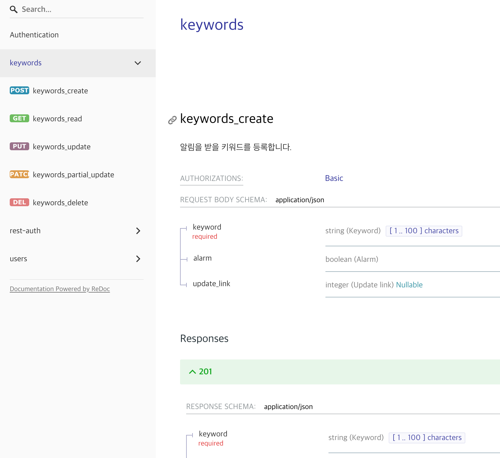
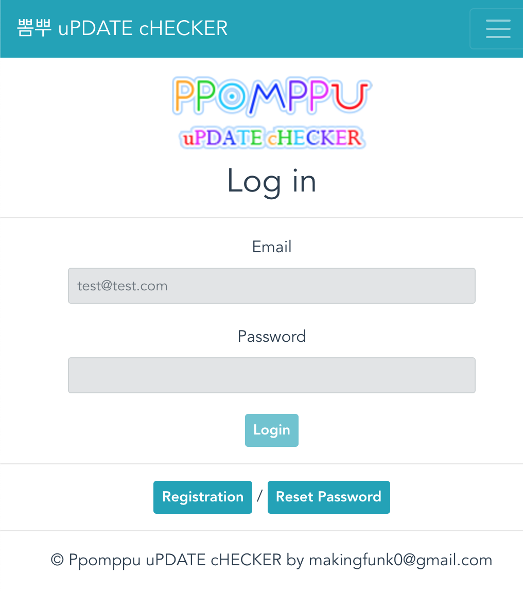
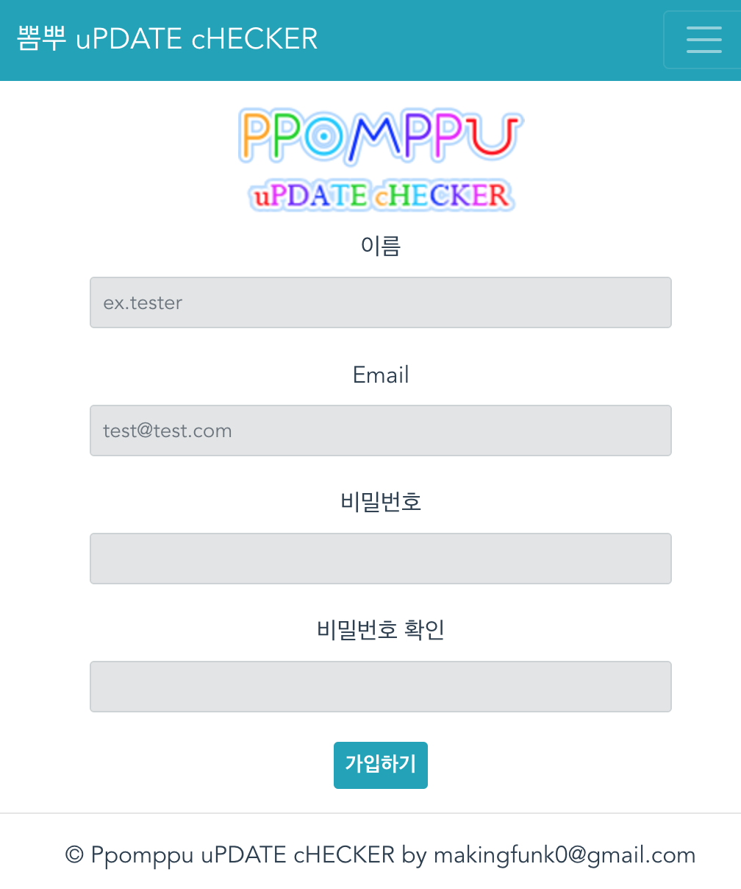
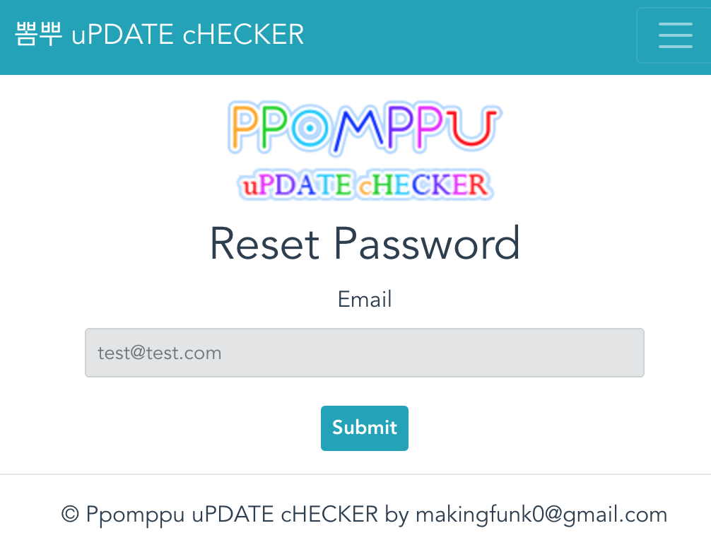
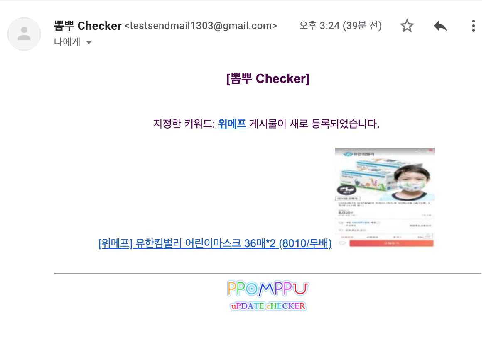
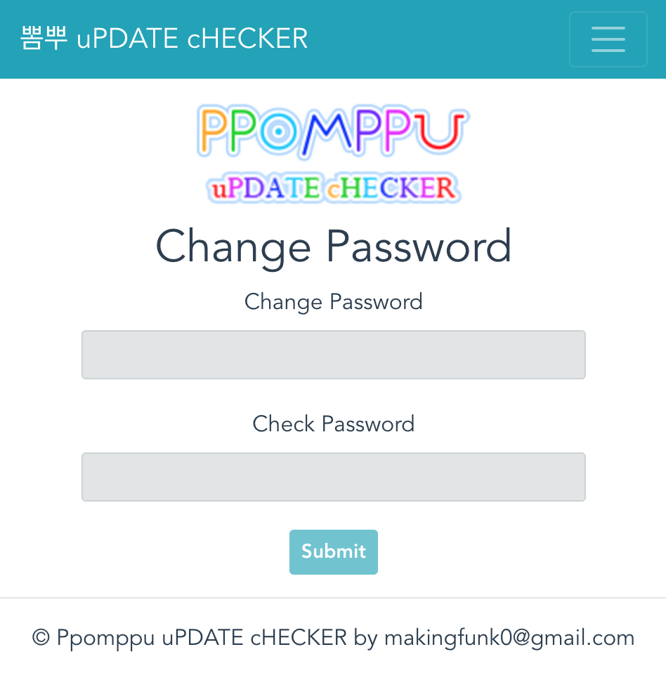
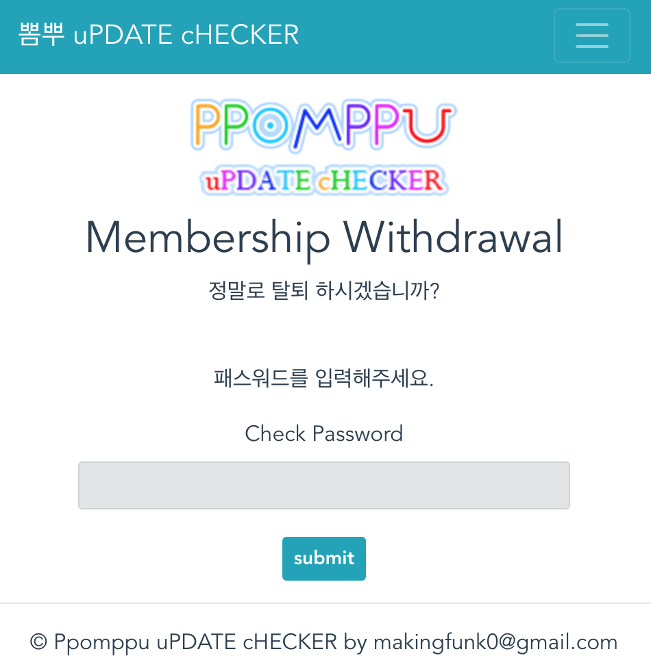

# Ppomppu_check

## [개인 프로젝트]  

뽐뿌 체커는 뽐뿌 사이트에 업로드되는 글들을 체크하고 알림 메일을 발송하는 서비스입니다.  
유저는 회원가입 후 원하는 키워드를 등록하면 뽐뿌 체커는 스케쥴대로 크롤링하여 새로운 게시물들을 체크하고, 유저가 등록한 키워드를 발견하면 알림 메일을 발송해줍니다.  

- 사용기술: Python, Django, DjangoRestFramework, Celery, AWS(EC2, ElastiCache(Redis), RDS(PostgreSQL)), JavaScript, Vue.js, firebase(front hosting), SSL(Cloud Flare), Docker, Sentry  
  
### [PpomppuChecker](https://pp-checker.czarcie.shop/)  
### [backend Github](https://github.com/KimDoKy/Ppomppu_check)  
### [frontend Github](https://github.com/KimDoKy/Ppomppu_check_front)


## Notice

- 2019.12.19
 - 배포를 EC2 직접 배포에서 Docker Compose으로 변경
- 2019.12.19
 - URL 변경: https://app.pycon.shop -> https://pp-checker.czarcie.shop

## Deploy

1. `.conf`에 셋팅파일 설정
 - `celery_ppomppu_beat.conf`
 - `celery_ppomppu_worker.conf`
 - `nginx.conf`
 - `nginx-app.conf`
 - `uwsgi.service`
 - `supervisor-app.conf`

2. Dockerfile 생성
 - `python3 build.py -m=base`
 - `python3 build.py -m=prod`

3. Docker Compose
 - `docker-compose up -d`

## API Document

```
git clone https://github.com/KimDoKy/Ppomppu_check.git
cd ppomppu
python manage.py runserver --settings=ppomppu.settings.dev
```
`http://localhost:8000/v1/redoc/` 으로 접속




--

## Snapshot

### Login



### Registration



### Reset password



### Keyword


### Email



### User info


### Change password


### Withdrawal

