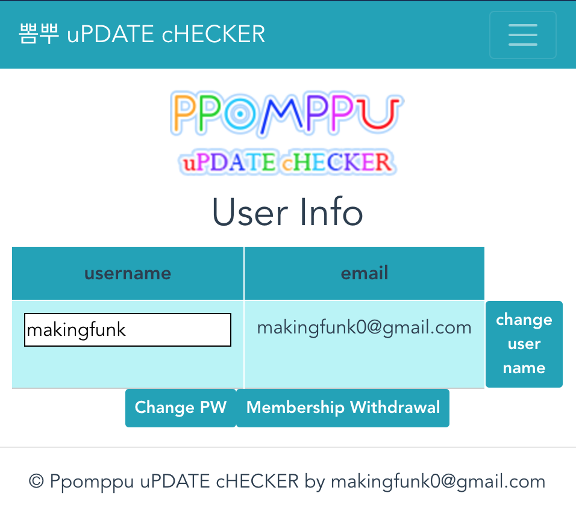

# Ppomppu_check

## [개인 프로젝트]  

뽐뿌 체커는 뽐뿌 사이트에 업로드되는 글들을 체크하고 알림 메일을 발송하는 서비스입니다.  
유저는 회원가입 후 원하는 키워드를 등록하면 뽐뿌 체커는 스케쥴대로 크롤링하여 새로운 게시물들을 체크하고, 유저가 등록한 키워드를 발견하면 알림 메일을 발송해줍니다.  

- 사용기술: Python, Django, DjangoRestFramework, Celery, AWS(EC2, ElastiCache(Redis), RDS(PostgreSQL)), JavaScript, Vue.js, firebase(front hosting), SSL(Cloud Flare)  
  
[PpomppuChecker](https://pp-checker.czarcie.shop/)  
[backend Github](https://github.com/KimDoKy/Ppomppu_check)  
[frontend Github](https://github.com/KimDoKy/Ppomppu_check_front)


## API Document

```
git clone https://github.com/KimDoKy/Ppomppu_check.git
cd ppomppu
python manage.py runserver --settings=ppomppu.settings.dev
```
`http://localhost:8000/v1/redoc/` 으로 접속


--

## Snapshot

### Login


### Registration


### Reset password


### Keyword


### Email


### User info



### Change password


### Withdrawal

